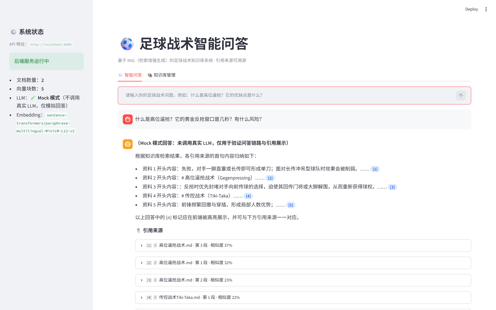
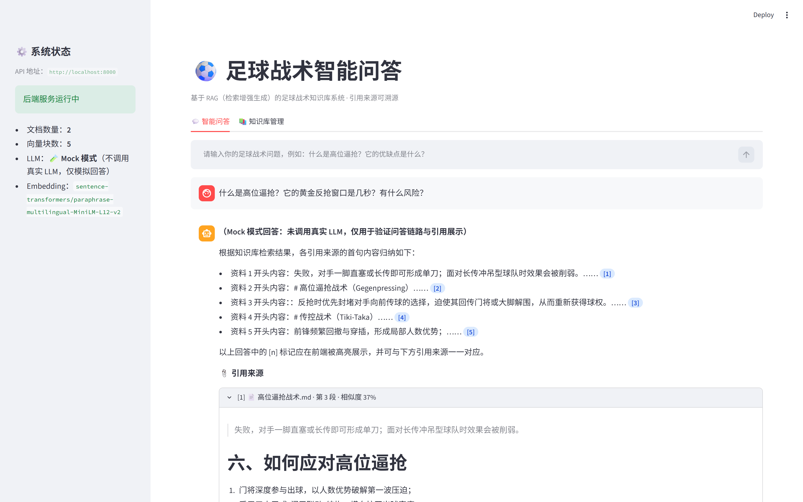
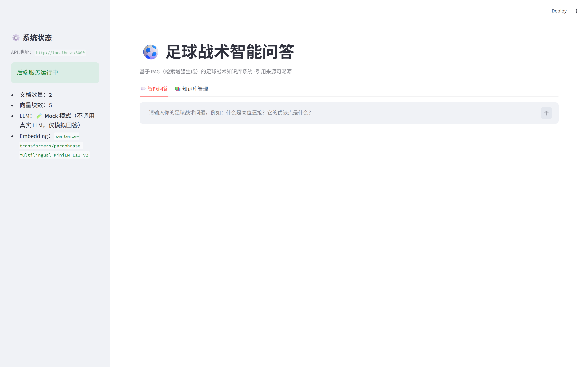
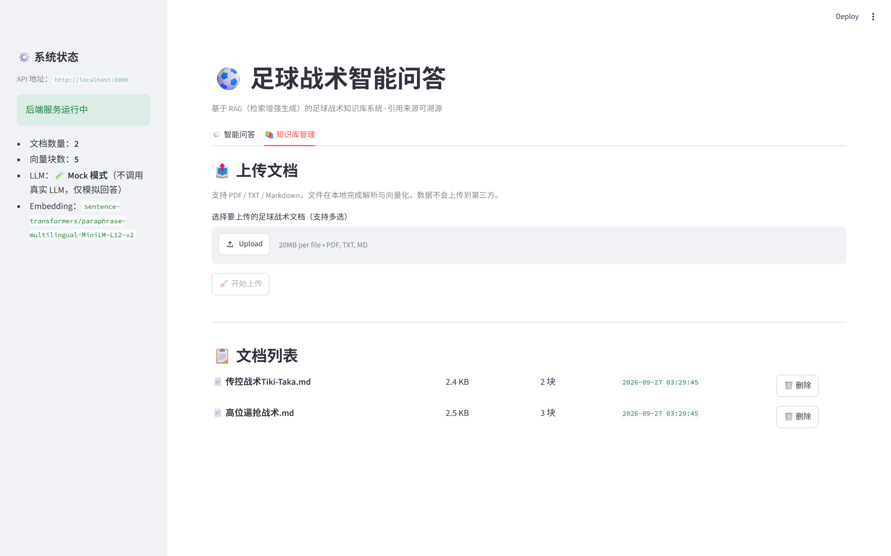
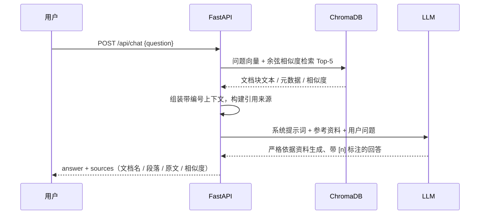

# ⚽ 足球战术智能问答 RAG 系统


基于 **FastAPI + ChromaDB + 本地 Embedding + Streamlit** 的检索增强生成（RAG）系统：上传足球战术文档（PDF / TXT / Markdown），系统自动完成解析、分块、向量化与入库，随后即可进行**带引用来源溯源**的智能问答。

> 🔒 **数据隐私**：文档解析与向量化全部在本地完成，Embedding 使用本地 sentence-transformers 模型，数据不经过任何第三方；仅最终生成环节通过 OpenAI 兼容接口调用 LLM（支持 DeepSeek、通义千问、OpenAI、Kimi、本地 Ollama 等）。
>
> 🧪 **开箱即用**：默认提供 Mock 模式与两篇示例战术文档，**无需任何 API Key** 即可跑通「上传 → 检索 → 引用溯源」完整链路。

---

## 🖼️ 界面预览

| 💬 智能问答（引用徽标高亮） | 📎 引用来源一键展开原文 |
|---|---|
|  |  |
| 🏠 问答首页（侧边栏实时系统状态） | 📚 知识库管理（上传 / 列表 / 删除） |
|  |  |

---

## ✨ 功能特性

- 📄 **多格式文档解析**：支持 PDF / TXT / Markdown；文本文件自动兼容 UTF-8 与 GBK 编码，PDF 按页提取并对扫描件给出明确提示
- ✂️ **层级文本分块**：按「段落 → 句子 → 字符」三级切分，相邻分块携带 50 字符重叠，避免上下文断裂（块大小、重叠数均可配置）
- 🔢 **本地向量化**：多语言 sentence-transformers 模型（`paraphrase-multilingual-MiniLM-L12-v2`），余弦相似度检索，模型缓存于本地
- 💬 **RAG 智能问答**：检索 Top-K 相关文档块注入提示词，约束模型**仅依据资料作答、用 `[n]` 标注引用、禁止编造**
- 📎 **引用来源溯源**：回答中的 `[1] [2]` 徽标高亮展示，可展开查看来源文档名、段落序号、原文片段与相似度分数
- 🗂️ **知识库管理**：Web 界面上传（支持多选、进度条）、文档列表、删除文档并**联动清理向量数据与原始文件**
- 🩺 **工程化能力**：Pydantic 参数校验、分层异常处理与中文错误提示、健康检查接口、自动目录初始化、首启自动导入示例文档
- 🐳 **一键容器化**：docker-compose 同时启动 API 与前端，数据与模型缓存持久化挂载
- 🧪 **Mock 模式**：无 API Key 时返回带引用标注的模拟回答，便于演示与链路自测

---

## 🧱 技术栈

| 层 | 选型 | 说明 |
|---|---|---|
| 后端框架 | FastAPI + Uvicorn | 异步 API、自动生成 Swagger 文档 |
| 前端界面 | Streamlit | 对话式 UI、文件上传、引用渲染 |
| 向量数据库 | ChromaDB（PersistentClient） | 本地嵌入式持久化，无需部署数据库服务 |
| Embedding | sentence-transformers + PyTorch（CPU） | 本地运行，多语言语义向量 |
| LLM 接入 | OpenAI Python SDK（兼容协议） | DeepSeek / 通义千问 / OpenAI / Kimi / Ollama |
| 文档解析 | pypdf | PDF 文本提取 |
| 数据校验 | Pydantic v2 + pydantic-settings | 请求/响应模型与 `.env` 配置管理 |
| 部署 | Docker / docker-compose | API + 前端双容器 |

---

## 🏗️ 系统架构

```mermaid
flowchart LR
    U["👤 用户浏览器"] -->|HTTP| FE["Streamlit 前端<br/>:8501 问答 / 知识库管理"]
    FE -->|REST /api/*| API["FastAPI 后端<br/>:8000"]
    API --> P["文档解析<br/>PDF / TXT / MD"]
    API --> S["层级分块<br/>500 字 + 50 重叠"]
    API --> E["本地 Embedding<br/>sentence-transformers"]
    E --> V[("ChromaDB<br/>本地持久化")]
    API -->|Top-K 余弦检索| V
    API -->|"OpenAI 兼容协议"| LLM["DeepSeek / 通义千问<br/>OpenAI / Kimi / Ollama"]
    LLM -->|带 [n] 引用的回答| API --> FE
```

**一次问答请求（RAG 主流程）：**



---

## 📁 目录结构

```
football-tactics-rag/
├── app/
│   ├── main.py                  # FastAPI 入口：生命周期、CORS、健康检查
│   ├── config.py                # 全局配置（.env 环境变量 / 路径 / RAG 参数）
│   ├── core/
│   │   ├── embeddings.py        # 本地 Embedding 模型单例封装
│   │   └── vector_store.py      # ChromaDB 增删查（cosine 检索）
│   ├── models/
│   │   └── schemas.py           # Pydantic 请求 / 响应模型
│   ├── routes/
│   │   ├── documents.py         # 文档上传 / 列表 / 删除接口
│   │   └── chat.py              # RAG 问答接口
│   └── services/
│       ├── document_parser.py   # PDF / TXT / MD 文本提取
│       ├── text_splitter.py     # 三级切分 + overlap 分块
│       ├── knowledge_base.py    # 入库编排 / 登记表 / 删除联动 / 示例导入
│       ├── llm_client.py        # OpenAI 兼容 LLM 客户端 + Mock 模式
│       └── rag_service.py       # 检索 → 组装上下文 → 生成（提示词工程）
├── frontend/
│   └── app.py                   # Streamlit 前端（问答 + 知识库管理）
├── .streamlit/
│   └── config.toml              # Streamlit 配置（上传上限 / 关闭遥测）
├── sample_docs/                 # 预置示例文档（首启自动导入）
│   ├── 高位逼抢战术.md
│   └── 传控战术Tiki-Taka.md
├── docs/screenshots/            # README 界面截图
├── data/                        # 运行时数据（自动创建，已在 .gitignore 忽略）
├── requirements.txt
├── Dockerfile
├── docker-compose.yml
├── .env.example                 # 环境变量模板
├── .gitignore
├── LICENSE
└── README.md
```

---

## 🚀 快速开始（本地启动）

### 0. 环境要求

- Python **3.10 ~ 3.12**（开发环境为 3.12）
- 首次启动需联网下载 Embedding 模型（约 470MB，已内置国内镜像加速）

### 1. 获取代码并创建虚拟环境

```bash
git clone https://github.com/<你的用户名>/football-tactics-rag.git
cd football-tactics-rag

python -m venv .venv
# Windows
.venv\Scripts\activate
# macOS / Linux
source .venv/bin/activate
```

### 2. 安装依赖

```bash
# Windows 用户建议先单独安装 CPU 版 torch（约 196MB，避免下载庞大的 CUDA 版本）
pip install torch==2.5.1+cpu --index-url https://download.pytorch.org/whl/cpu
# 国内网络如官方源超时，可改用阿里云镜像（注意把 cp312 换成与你 Python 版本一致的标识）：
# pip install https://mirrors.aliyun.com/pytorch-wheels/cpu/torch-2.5.1+cpu-cp312-cp312-win_amd64.whl

pip install -r requirements.txt
```

### 3. 配置环境变量

```bash
# Windows (PowerShell)
Copy-Item .env.example .env
# macOS / Linux
cp .env.example .env
```

`.env.example` 默认 `LLM_MOCK_MODE=true`，**此时无需任何 Key**，直接进入下一步即可完整体验。
如需真实 LLM 回答：在 `.env` 中填入 `OPENAI_API_KEY`，并把 `LLM_MOCK_MODE` 改为 `false`（配置方式见下文）。

### 4. 启动后端 API（端口 8000）

```bash
uvicorn app.main:app --host 0.0.0.0 --port 8000
# 或
python -m app.main
```

> 首次启动会自动创建 data 目录、初始化 ChromaDB、下载 Embedding 模型，并自动导入 `sample_docs/` 下的两篇示例文档。

### 5. 新开终端，启动前端（端口 8501）

```bash
streamlit run frontend/app.py --server.port 8501
```

### 6. 访问系统

- 前端问答界面：<http://localhost:8501>
- API 交互文档（Swagger）：<http://localhost:8000/docs>
- 健康检查：<http://localhost:8000/api/health>

---

## 🐳 快速开始（Docker 一键启动）

```bash
# 1. 准备环境变量（Mock 模式下可保持默认，不填 Key）
Copy-Item .env.example .env     # macOS/Linux: cp .env.example .env
# 2. 一键构建并启动 API(8000) + 前端(8501)
docker compose up -d --build
```

访问 <http://localhost:8501>（前端）与 <http://localhost:8000/docs>（API 文档）。

> `./data` 挂载持久化文档与向量库；HuggingFace 模型缓存保存在 `hf_cache` 卷中，重启不重复下载。

---

## 📖 使用流程

1. 打开 <http://localhost:8501>，左侧栏可看到后端状态、文档数、向量块数与 LLM 模式
2. 在 **💬 智能问答** 页直接提问，例如：*"什么是高位逼抢？它的黄金反抢窗口是几秒？有什么风险？"*
3. 回答中的蓝色 `[1] [2]` 徽标对应引用来源，展开 **📎 引用来源** 可查看文档名、段落、原文片段与相似度
4. 在 **📚 知识库管理** 页上传自己的战术文档（支持多选），或删除文档（向量数据同步清理）

---

## 🔌 API 接口一览

服务启动后可在 <http://localhost:8000/docs> 查看并在线调试全部接口。

| 方法 | 路径 | 说明 |
|---|---|---|
| `GET` | `/api/health` | 健康检查（运行状态 / 文档数 / 向量数 / LLM 模式） |
| `POST` | `/api/documents/upload` | 上传文档（multipart/form-data，字段名 `file`） |
| `GET` | `/api/documents` | 获取文档列表 |
| `DELETE` | `/api/documents/{doc_id}` | 删除文档（联动删除向量数据） |
| `POST` | `/api/chat` | RAG 问答，请求体 `{"question": "..."}` |

请求示例：

```bash
# 智能问答
curl -X POST http://localhost:8000/api/chat \
  -H "Content-Type: application/json" \
  -d '{"question": "高位逼抢的黄金反抢窗口是多少秒？"}'

# 上传文档
curl -X POST http://localhost:8000/api/documents/upload \
  -F "file=@战术笔记.pdf"
```

问答响应示例（节选）：

```json
{
  "question": "高位逼抢的黄金反抢窗口是多少秒？",
  "answer": "……丢球后的 **5 秒** 是黄金反抢窗口 [1]……",
  "sources": [
    {
      "index": 1,
      "doc_name": "高位逼抢战术.md",
      "chunk_index": 2,
      "snippet": "高位逼抢的核心在于丢球后 5 秒内立即实施反抢……",
      "score": 0.8366
    }
  ]
}
```

---

## 🔑 LLM 配置说明

所有提供 OpenAI 兼容接口的模型均可接入，只需修改 `.env` 中三个变量：

| 提供商 | OPENAI_BASE_URL | LLM_MODEL | 获取 Key |
|---|---|---|---|
| **DeepSeek**（默认） | `https://api.deepseek.com/v1` | `deepseek-chat` | https://platform.deepseek.com |
| **通义千问** | `https://dashscope.aliyuncs.com/compatible-mode/v1` | `qwen-plus` | https://bailian.console.aliyun.com |
| **OpenAI** | `https://api.openai.com/v1` | `gpt-4o-mini` | https://platform.openai.com |
| **月之暗面 Kimi** | `https://api.moonshot.cn/v1` | `moonshot-v1-8k` | https://platform.moonshot.cn |
| **本地 Ollama** | `http://localhost:11434/v1` | `qwen2.5:7b` | 无需 Key（随意填写） |

```env
# 示例：切换为通义千问
OPENAI_API_KEY=sk-xxxxxxxxxxxxxxxx
OPENAI_BASE_URL=https://dashscope.aliyuncs.com/compatible-mode/v1
LLM_MODEL=qwen-plus
LLM_MOCK_MODE=false
```

修改后重启 API 服务生效。

### 全部环境变量

| 变量 | 默认值 | 说明 |
|---|---|---|
| `OPENAI_API_KEY` | 空 | LLM API Key（真实 LLM 模式下必填） |
| `OPENAI_BASE_URL` | DeepSeek 地址 | OpenAI 兼容接口地址 |
| `LLM_MODEL` | `deepseek-chat` | 模型名称 |
| `LLM_TEMPERATURE` | `0.3` | 生成温度 |
| `LLM_TIMEOUT` | `60` | LLM 请求超时（秒） |
| `LLM_MOCK_MODE` | `true` | Mock 模式：不调用真实 LLM，返回带引用标注的模拟回答 |
| `EMBEDDING_MODEL` | 多语言 MiniLM | 本地 Embedding 模型（HuggingFace 模型 ID 或本地路径） |
| `HF_ENDPOINT` | `https://hf-mirror.com` | HuggingFace 镜像（国内加速，海外网络可注释） |
| `CHUNK_SIZE` | `500` | 分块最大字符数 |
| `CHUNK_OVERLAP` | `50` | 相邻分块重叠字符数 |
| `TOP_K` | `5` | 检索返回文档块数量 |
| `DATA_DIR` | `./data` | 数据存储目录 |
| `MAX_UPLOAD_SIZE_MB` | `20` | 单文件上传大小上限（前后端一致） |
| `API_BASE_URL` | `http://localhost:8000` | 前端访问后端的地址（compose 内自动覆盖） |

---

## 💡 工程设计要点（面试向）

1. **完整的 RAG 闭环**：文档解析 → 三级分块 → 本地向量化 → 持久化存储 → 语义检索 → 提示词约束生成 → 引用溯源，每一环均可独立替换
2. **防幻觉提示词工程**：系统提示词强制「只依据资料作答、句末 `[n]` 标注、资料不足显式说明」，并将引用编号与检索结果结构化对应
3. **分层清晰、职责单一**：`routes / services / core / models` 四层架构，业务编排（knowledge_base、rag_service）与基础设施（vector_store、llm_client）解耦
4. **健壮性设计**：登记文件损坏自愈、入库失败不产生脏向量、删除操作三方联动（向量 + 原文件 + 登记表）、多类 LLM 异常翻译为用户可读提示
5. **隐私友好与低成本**：Embedding 完全本地运行；LLM 层通过兼容协议可随时切换云端小模型或本地 Ollama
6. **可复现的工程细节**：依赖版本上限锁定、环境变量模板、健康检查、Docker 双容器编排、国内网络镜像加速

---

## ❓ 常见问题（FAQ）

**Q1：Windows 启动报 `ImportError: DLL load failed ... 应用程序控制策略已阻止此文件`（torch 相关）？**
这是 Windows **Smart App Control（智能应用控制）**拦截了新版 torch（2.6+）未签名的原生 DLL。两种解决方式：
- ✅ **推荐**：安装发布时间较长、已有系统信誉的 CPU 版 torch 2.5.1（本项目 requirements 已将 torch 上限锁定为 `<2.6`，全新安装不会触发）：
  ```bash
  pip install torch==2.5.1+cpu --index-url https://download.pytorch.org/whl/cpu
  # 国内镜像：
  pip install https://mirrors.aliyun.com/pytorch-wheels/cpu/torch-2.5.1+cpu-cp312-cp312-win_amd64.whl
  ```
- 或在「Windows 安全中心 → 应用和浏览器控制 → 智能应用控制」中关闭该功能（**注意：关闭后无法再重新开启**，需自行权衡）。

**Q2：首次启动卡在下载 Embedding 模型？**
模型约 470MB，项目已默认配置国内镜像 `HF_ENDPOINT=https://hf-mirror.com`。网络仍不稳定时，可手动下载模型到本地，将 `.env` 中 `EMBEDDING_MODEL` 改成本地目录路径。

**Q3：不配置 API Key 能用吗？**
可以。`.env.example` 默认开启 `LLM_MOCK_MODE=true`，检索、分块、引用链路全部真实运行，仅最终回答由内置 Mock 逻辑生成（会明确标注）。填入真实 Key 并将其改为 `false` 后切换为真实 LLM。

**Q4：问答接口报 503「未配置 OPENAI_API_KEY」？**
说明当前是非 Mock 模式但 `.env` 未填写有效 Key，或修改后未重启 API 服务。

**Q5：PDF 上传后提示无法提取文本？**
扫描件 / 纯图片 PDF 无法直接提取文字，请先用 OCR 工具（Adobe、WPS、PaddleOCR 等）转为文本型 PDF。

**Q6：如何彻底重置知识库？**
停止服务后删除 `data/` 目录，重启会自动重建并重新导入示例文档。

**Q7：删除示例文档后重启又出现了？**
系统启动时会按文件名自动导入 `sample_docs/` 中尚未入库的文档；如不需要，把对应文件移出该目录即可。

---

## 📄 License

[MIT License](LICENSE)
